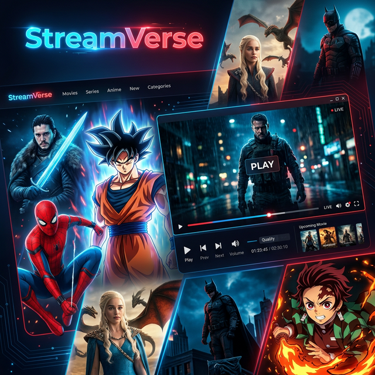

# 🌌 StreamVerse | Endless Entertainment



StreamVerse is a premium, high-performance web application designed for streaming movies, TV shows, anime, and reading manga. Built with a focus on speed, reliability, and visual excellence, it provides a seamless cinematic experience directly in your browser.

## ✨ Key Features

- 🎥 **Multi-Source Video Player**: Advanced player supporting HLS/M3U8, DASH, and direct MP4 streams with automatic source switching.
- 📡 **Resilient API System**: Intelligent fallback mechanism that automatically switches between primary and secondary metadata servers (TMDB, Consumet) to ensure 24/7 uptime.
- 🇰🇷 **K-Drama & Anime**: Dedicated sections for Asian dramas and anime with specialized scrapers and providers.
- 📖 **Manga Reader**: Integrated manga reader with high-quality image loading and chapter navigation.
- 🔇 **Silent Audio Switching**: Change audio tracks (Dub/Sub) without video stutters or interruptions.
- 🌓 **Dynamic Design**: A stunning, responsive UI with glassmorphism, micro-animations, and a mobile-optimized tab layout.
- ⚡ **Lightning Fast**: Local caching system for metadata and search results, reducing load times significantly.

## 🛠️ Tech Stack

- **Frontend**: Vanilla HTML5, CSS3 (Custom Variables/Tokens), JavaScript (ES6+)
- **Video Playback**: [Hls.js](https://github.com/video-dev/hls.js), [Plyr.js](https://plyr.io/), [Dash.js](https://github.com/Dash-Industry-Forum/dash.js)
- **APIs**: TMDB Meta API (Primary), Consumet API (Fallback)
- **Styling**: Pure CSS with cinematic dark-mode aesthetics.

## 🚀 Getting Started

### Prerequisites
- A modern web browser (Chrome, Firefox, Safari, Edge).
- A local web server (optional, but recommended for development).

### Installation
1. Clone the repository:
   ```bash
   git clone https://github.com/JeetRana1/StreamVerse.git
   ```
2. Navigate to the project folder:
   ```bash
   cd StreamVerse
   ```
3. Open `index.html` in your browser or serve it using a local server:
   ```bash
   # Example using python
   python -m http.server 8000
   ```

## ⚙️ Configuration

The application can be configured via `config.js`. You can set your primary and fallback API endpoints here:

```javascript
window.__STREAMVERSE_CONFIG__ = {
    PROD_META_API_BASE: 'https://yourdomain.com/meta/tmdb',
    FALLBACK_API_BASE: 'https://yourdomain.com/meta/tmdb',
    // ... other settings
};
```

## 🛡️ Resilience & Fallback Logic

StreamVerse is built to be "unbreakable." If the primary metadata API (yourdomain.com) returns an error or times out, the system automatically:
1. Retries the request with an alternate media type (TV vs Movie).
2. Falls back to a secondary production server.
3. Attempts a final "last-resort" fetch on the primary server with extended timeouts.

## 📱 Mobile Experience

StreamVerse is fully responsive and features a **Mobile Tabs Navigation** for a native app-like experience on iOS and Android devices.

## ⚖️ Disclaimer

StreamVerse does not host any files on its servers. All content is provided by non-affiliated third-party providers.

---
Developed with ❤️ by the StreamVerse Team.
